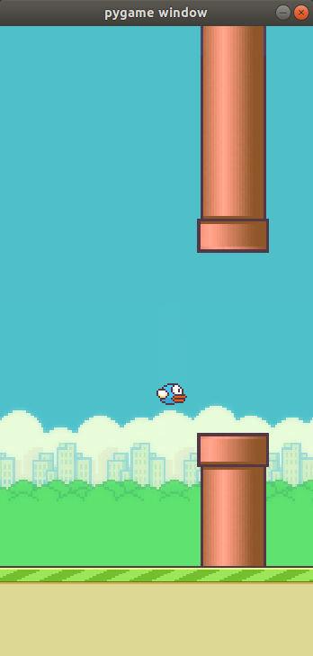

<h4 align="center"> 
	Jogo do Flappy Bird feito com Python 🕊️
</h4>

<h1 align="center">
    
</h1>


## :information_source: Programa

Esse foi meu primeiro jogo feito usando pygame. É o jogo tradicional onde tem um pássaro na tela 
e tem que passar entre os canos, se o pássaro colidir com os canos ou com o chão o jogo termina. 


## :information_source: Como usar

Para roda-lo em sua máquina será necessário ter python3 e pygame instalados.

No terminal digite:

```bash
# Clonar esse repositório
$ git clone https://github.com/andreocunha/Flappybird_Python.git

# Vá para o ropositório
$ cd Flappybird_Python

# Execute
$ python3 flappy.py 

```
Irá abrir uma janela com o jogo, para movimentar o pássaro use a barra de espaço. Assim que o passáro colidir a janela será fechada.

Feito com ♥ por André Oliveira Cunha :wave: [Linkedin](https://www.linkedin.com/in/andr%C3%A9-oliveira-cunha-b26b3a156/)
